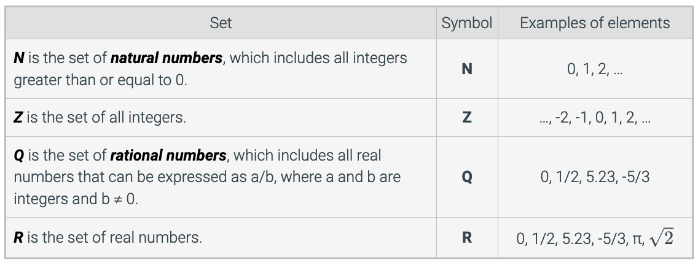
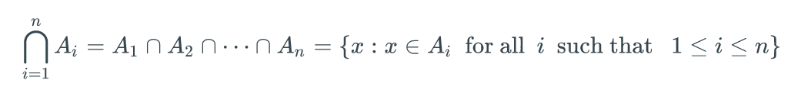
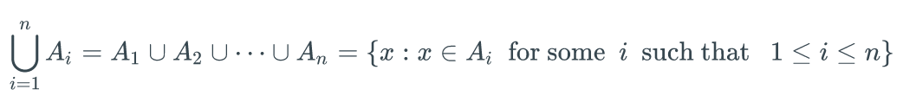
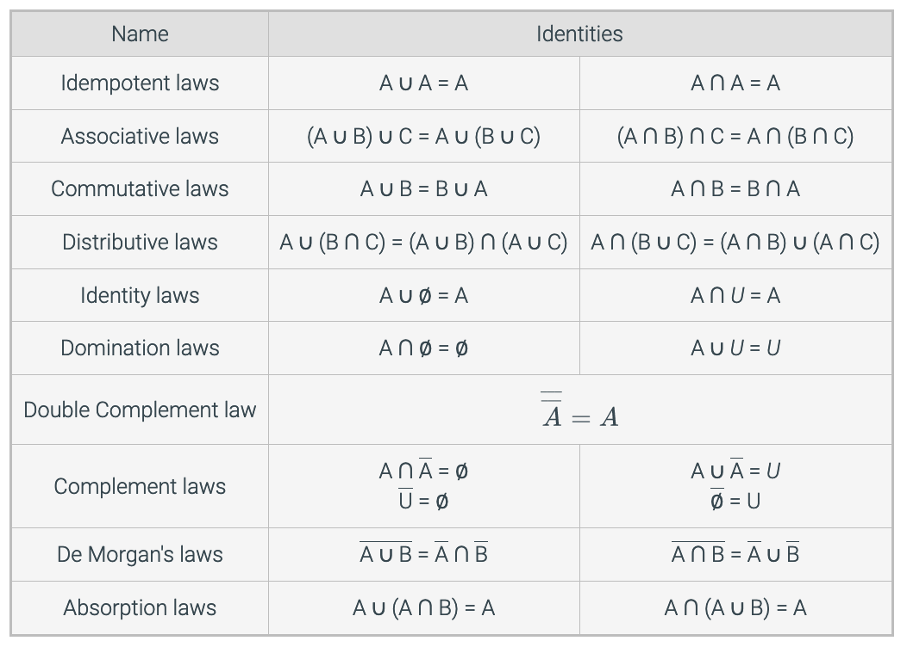

# Discrete Math - Week 3

**Learning Objectives**
* [Understand Sets and Subsets](#sets-and-subsets)
* [Understand Set Operations](#set-operations)
* [Understand Set Identities](#set-identities)

## Sets and Subsets

### Definitions and Set Basics

**Set:** A collection of objects. Objects may be of various types, such as titles of books, names of bridges, or rational numbers.

**Elements:** The objects in a set.

A set may contain elements of different varieties, e.g., a set whose elements are the number 2, a strawberry, and a monkey.

**Roster Notation of a Set:** A = { 2, 4, 6, 10 }

Th order of the elements in the set is not important, so the example above could also be expressed as A = { 10, 6, 4, 2 }.

**∈ denotes an element is in a set, as in 2 ∈ A. ∉ indicates that an element is not in a set, as in 5 ∉ A.** 

When there are many elements in a set, ellipses (...) are used to denote a long (possibly infinite) sequence of numbers. The sequence's pattern should be clear so that the reader can infer which elements are missing.

    B = { 1, 3, 5, ... , 99 } // odd integers 0-100

    C = { 3, 6, 9, 12, .... } // + multiples of 3

**Empty Set:** A set with no elements denoted by the symbol ∅ and sometimes referred to as the null set. It can also be denoted by {}. The **cardinality** of the empty set |∅| is zero.

**For any element a in an empty set, a ∉ ∅ is true.**

**Finite Set:** A set with a finite number of elements. The **cardinality** of a finite set A, denoted by |A|, is the number of elements in A. If A = { 2, 4, 6, 10 }, then |A| = 4. 

**Infinite Set:** A set with an infinite number of elements.

**Two sets are equal if they have exactly the same elements.**

    D = { 3, 4, 5 }

    E = { 5, 3, 4 }

    F = { 5, 3, 4, 6 }

D = E because for any a, a ∈ D if and only if a ∈ E. Remember that the order in which the elements are listed in the definitions of D and E is unimportant. F ≠ E because 6 ∈ F but 6 ∉ E.

Some sets of numbers have their own symbols. Here are some of the most common examples:

  

The superscript + indicates the positive elements of a particular set. For example:
* R+ is the set of all positive real numbers.
* Z+ is the set of all positive integers.

The superscript - indicated the negative elements of a particular set. For example:
* R- is the set of all negative real numbers.
* Z- is the set of all negative integers.

The number 0 is neither positive nor negative, so 0 ∉ Z+ and 0 ∉ Z-. 

**Set Builder Notation:** A set is defined by specifying that the set includes all elements in a larger set that also satisfy certain conditions. **A = { x ∈ S : P(x) }**

The description for A above would read: "all x in S such that P(x)".

**Universal Set:** A set that contains all elements mentioned in a particular context, denoted by the variable U. 

Sets are often represented pictorially with **Venn diagrams**. A rectangle is used to denote the universal set U, and oval shapes are used to denote sets within U.

If every element in A is also an element of B, then A is a **subset** of B, denoted as A **⊆** B If there is an element of A that is not an element of B, then A is not a subset of B, denoted as A **⊈** B.

**A = B if and only if A ⊆ B and B ⊆ A**

If A ⊆ B and there is an element of B that is not an element of A (i.e., A ≠ B), then A is a **proper subset** of B, denoted as A ⊂ B.

### Set of Sets

It is possible that the elements of a set are themselves sets, as in A = { { 1, 2 }, ∅, { 1, 2, 3 }, { 1 } }.

The empty set ∅ is not the same as { ∅ }. The cardinality of { ∅ } is one since it contains exactly one element, which is the empty set.

The **power set** of a set A, denoted P(A), is the set of all subsets of A.

If A = { 1, 2, 3 }, then P(A) = { ∅, { 1 }, { 2 }, { 3 }, { 1, 2 }, { 1, 3 }, { 2, 3 }, { 1, 2, 3 } }.

Since |A| = 3, the cardinality of the power set of A is 23 = 8.

**Cardinality of a Power Set:** Let A be a finite set of cardinality n. Then the cardinality of the power set of A is 2n, or |P(A)|=2n.

## Set Operations

### Union and Intersection

Sets can be combined to create new sets.

**Intersection:** The intersection of A and B, denoted A ∩ B and read "A intersect B", is the set of all elements that are elements of both A **and** B.

**Union:** The union of two sets, A and B, denoted A ∪ B and read "A union B", is the set of all elements that are elements of A **or** B.

Set operations can be combined to define even more sets. The set A ∪ ( B ∩ C ) is the union of the set A and the set B ∩ C.

In the absence of parentheses, the order in which operations are applied does not matter.

**Notation:**

  

  

### Set Difference and Symmetric Difference

The **difference** between two sets A and B, denoted A - B, is the set of elements that are in A but not in B.

The **symmetric difference** between two sets, A and B, denoted A ⊕ B, is the set of elements that are a member of exactly one of A and B, but not both. The symmetric difference can also be defined as:

    A ⊕ B = ( A - B ) ∪ ( B - A )

### Set Complement

The **complement** of a set A, denoted A, is the set of all elements in U that are not elements of A. An alternative definition of A is U - A. 

### Cartesian Products

**Ordered Pair:** (x, y)

The order of entries in an ordered pair is significant, unlike in sets.

For two sets, A and B, the **Cartesian product** of A and B, denoted **A x B**, is the set of all ordered pairs in which the first entry is in A and the second entry is in B. That is:

    A x B = { (a, b) : a ∈ A and b ∈ B }

Since the order of the elements in a pair is significant, A x B will not be the same as B x A, unless A = B.

**Ordered Triple:** (x, y, z)

**Ordered n-tuple:**  An ordered list of n items for n ≥ 4.

The Cartesian product of three sets contains ordered triples, and for n ≥ 4, the Cartesian product of n sets contains n-tuples. The Cartesian product of n sets, A1, A2, ..., An is

    A1 x A2 x ... x An = { (a1, a2, ... , an) : ai ∈ Ai for all i such that 1 ≤ i ≤ n } 

### Strings

**String:** A sequence of characters.

**Alphabet:** The set of characters used in a set of strings.

**Length:** The number of characters in the string.

**Binary String:** A string whose alphabet is {0, 1}.

**Bit:** A character in a binary string

A string of length n is also called an **n-bit string**. The set of binary strings of length n is denoted as {0,1}n.

**Empty String:** A unique string whose length is 0 and is usually denoted by the symbol λ

**Concatenation:** f s and t are two strings, then the concatenation of s and t (denoted st) is a longer string obtained by putting s and t together.

## Set Identities

**Set Identity:** An equation involving sets that is true regardless of the contents of the sets in the expression. 

The idea of a set identity is similar to an equivalence in logic which holds regardless of the truth values of the individual variable in the expressions.

  

