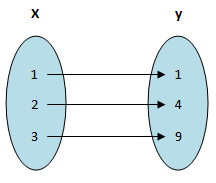

# Discrete Math: Functions

**Learning Objectives:**
* [Define Functions](#definition-of-functions)
* [Understand Function Properties](#properties-of-functions)
* [Understand Inverse Functions](#the-inverse-of-a-function)
* [Understand Composition of Functions](#composition-of-functions)

## Definition of Functions

A function f from set X to set Y, denoted f: X → Y, assigns each element of X to exactly one element of Y. Functions may also be called mappings or transformations. **X maps to Y meaning f(x) = y.**

Every input value has exactly one output value. Functions can be depicted using an **arrow diagram** as seen in the following image.

* Set X is the **domain** of the relation, and 1,2,3 is the **object**
* Set Y is the **target** of the relation, and 1,4,9 is the **image**
* The **range** is the subset of the target which contains all the images that have been mapped, in this case the range = {1,4,9}.
* In an arrow diagram, the range is the set of elements in the target that have arrows coming into them.
* This can also be written as a set of ordered pairs (x,y) = {(1,1), (2,4), (3,9)}

For function f: X → Y, an element y is in the range of f if and only if there is an x ∈ X such that (x, y) ∈ f. Expressed in set notation:

    Range of f = { y: (x, y) ∈ f, for some x ∈ X }

### Representing Functions

Explicit Statement: f(a) = 1, f(b) = 2, f(c) = 1

Formula: f(x) = x2 + 1

A relation A x B: (1, 2), (2,3), (4,5)

### Function Equality

Two functions, f and g, are equal if f and g have the same domain and target, and f(x) = g(x) for every element x in the domain. The notation f = g is used to denote the fact that functions f and g are equal.

## Properties of Functions

A function f: X → Y is **one-to-one** or **injective** if x1 ≠ x2 meaning f(x1) ≠ f(x2). Thus, f maps different elements in X to different elements in Y.

A function f: X → Y is **onto** or **surjective** if the range of f is equal to the target Y. That is, for every y ∈ Y, there is an x ∈ X such that f(x) = y. 

A function is **bijective** if it is both one-to-one and onto. A bijective function is called a **bijection**. A bijection is also called a **one-to-one correspondence**.

The properties of being one-to-one or onto are important in many situations. For example, consider a function that maps employees to offices. If the function is one-to-one, then no one has to share an office. If the function is onto, then there are no empty offices and the company's space is well utilized. 

Whether a function is one-to-one, onto, or bijective can tell us about the relative sizes of the domain and target:
* f: D → T is one-to-one, so |D| ≤ |T|
* f: D → T is onto, so |D| ≥ |T|
* f: D → T is a bijection, so f is |D| ≤ |T| and |D| ≥ |T|, which implies that |D| = |T|

One way to count the elements in a set is to define a bijection between that set and another set whose size is already known.

## The Inverse of a Function

If a function f: X → Y is a bijection, then the **inverse** of f is obtained by exchanging the first and second entries in each pair in f. The inverse of f is denoted by f-1:

**f-1 = { (y, x) : (x, y) ∈ f }**

A function f has an inverse if and only if f is a bijection. f-1 is a well-defined function if every element in Y is mapped to exactly one element in X. 

If f is a bijection from X to Y, then for every x ∈ X and y ∈ Y, **f(x) = y if and only if f-1(y) = x**.

Therefore the value of f-1(y) is the unique element x ∈ X such that f(x) = y. If f-1 is the inverse of function f, then for every element x ∈ X, f-1(f(x)) = x.

The function f: R → R defined by f(x) = x2 is not one-to-one because f(x) = f(-x) for any real number x. However, is the domain is restricted to positive reals, R+, then f is a bijection. So, to solve for f-1, express y - x2 and solve for x in terms of y: x = √y. Therefore, f-1(y) = √y.

## Composition of Functions

**Composition:** The process of applying a function to the result of another function.

Generally, the order in which the functions are applied is important, so f ο g is not the same as g ο f.

The **identity function** always maps a set onto itself and maps every element onto itself. 

The identity function on A, denoted IA: A → A, is defined as IA(a) = a, for all a ∈ A. if a function f from A to B has an inverse, then f composed with its inverse is the identity function. 

**Let f: A → B be a bijection. Then f-1 ο f = IA and f ο f-1 = IB**

